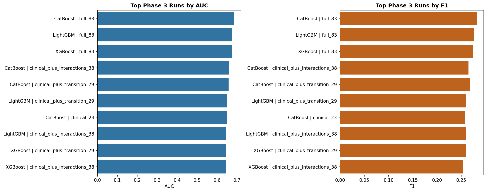
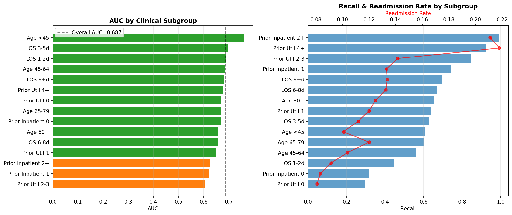
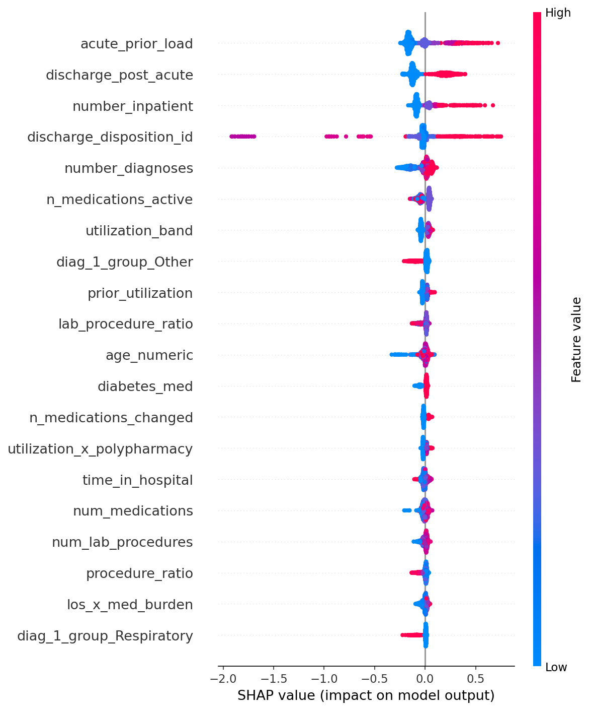
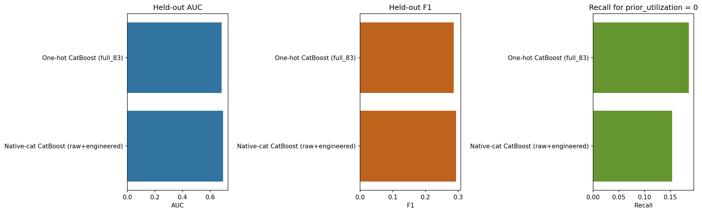

# Healthcare Readmission Predictor

Predicting 30-day hospital readmission risk for diabetic patients using ML on 101,766 real encounters from 130 US hospitals (UCI Diabetes dataset).

## Problem

Hospital readmissions cost the US healthcare system over $26 billion annually. The Hospital Readmissions Reduction Program (HRRP) penalizes hospitals with excess readmission rates. Current clinical tools like the LACE index have limited predictive power (AUC ~0.55-0.66), flagging too many patients as high-risk for meaningful intervention.

This project builds a research-grade ML pipeline that:
- Compares multiple model architectures head-to-head
- Engineers features informed by clinical literature
- Benchmarks against industry-standard clinical scoring tools
- Tests against frontier LLMs (GPT-5.4, Claude Opus 4.6) on the same prediction task

## Dataset

| Metric | Value |
|--------|-------|
| Source | UCI ML Repository — Diabetes 130-US Hospitals (1999-2008) |
| Total encounters | 101,766 |
| Readmission rate | 11.2% (30-day) |
| Features (raw) | 50 |
| Features (engineered) | 69 |
| Production split | 60/10/10/20 train / early-stop / calibration / test |

## Current Status

**Phase:** 7 of 7 completed
**Best R&D Model:** Native-cat CatBoost (raw+engineered, calibrated) — AUC 0.694, F1 0.293, Brier 0.093
**Production Model:** CatBoost (Optuna-tuned, full_83, calibrated) — AUC 0.683, F1 0.286, Brier 0.094, 0.01 ms/sample
**Target:** AUC > 0.70 (published SOTA: 0.78-0.87)
**Models Compared:** ~37 configurations across 7 phases

## Key Findings

1. Native categorical handling is the biggest remaining lift. Preserving raw diagnosis, medication-state, and discharge categories improved held-out AUC from 0.683 to 0.694 and F1 from 0.286 to 0.293; paired bootstrap on the same test set gave a 95% AUC delta CI of +0.007 to +0.015.
2. The first-timer blind spot is still structural. The better native-cat ranker actually lowered `prior_utilization == 0` recall from 0.186 to 0.154, so richer categorical signal improves global ranking but does not solve cohort heterogeneity.
3. SMOTE destroys performance on this dataset — F1 drops 0.277→0.104; cost-sensitive class weighting is strictly superior.
4. The model is clinically defensible — SHAP confirms Prior Utilization + Discharge Pathway account for 53% of feature importance, matching AHRQ readmission literature (rho=0.971 with native importance).
5. Production inference remains trivial operationally at 0.01 ms/sample; the stricter 60/10/10/20 production split lowered reported metrics slightly, but the pipeline is now cleaner because early stopping and calibration use separate holdouts.

## Iteration Summary

<!-- Iteration summaries appended daily by readme-updater cron -->
<!-- Format: Phase N: Title — Date (one combined entry per phase) -->

### Phase 1: Domain Research + Dataset + Baseline — 2026-04-01

<table>
<tr>
<td valign="top" width="38%">

**EDA Run 1 (Clinical Baseline):** Built LACE proxy + LogReg on 68 and 23 clinical features. 23-feature clinical LogReg (AUC 0.645) nearly matched 68 features (AUC 0.648) — domain knowledge compresses feature space 66% with negligible loss.<br><br>
**EDA Run 2 (Workflow Compression):** How few features can you use and still get a usable signal? Linear SVM on just 8 workflow proxies (utilization, LOS, meds, test-ordering) hit AUC 0.633. Missingness-only BernoulliNB collapsed to 0.539 — lab ordering patterns alone carry almost nothing.

</td>
<td align="center" width="24%">


</td>
<td valign="top" width="38%">

**Combined Insight:** Signal is highly compressible but not infinitely so. 23 features → 8 workflow features loses only 0.012 AUC, but pure missingness features carry almost no signal. The floor is utilization + LOS, not lab ordering patterns alone.<br><br>
**Surprise:** A1C ordering correlates with *lower* readmission; glucose ordering with *higher* — asymmetric, not a uniform "tested = sicker" pattern.<br><br>
**Research:** Mcllhargey et al. 2023 — missing lab patterns reflect clinician concern, so we used test-ordering as first-class features. Held for glucose, not A1C.<br><br>
**Best Model So Far:** LogReg (68 features, balanced) — AUC 0.648, F1 0.260, Recall 0.537

</td>
</tr>
</table>

---

### Phase 2: Multi-Model Experiment — 2026-04-02

<table>
<tr>
<td valign="top" width="38%">

**Model Run 1 (6-Family Sweep):** Compared 6 model families (XGBoost, LightGBM, CatBoost, RF, GBM, SVM-RBF) on 68 and 23 features + 5 imbalance strategies on XGBoost. CatBoost won at AUC 0.686, F1 0.283, Recall 0.585.<br><br>
**Model Run 2 (Algorithm Ceiling Test):** Can boosters extract more from those 8 workflow features than Phase 1's Linear SVM did? XGBoost, LightGBM, and CatBoost all tested — best was CatBoost at AUC 0.634 vs SVM's 0.633. Effectively zero gain, proving the ceiling is the features, not the algorithm.

</td>
<td align="center" width="24%">


</td>
<td valign="top" width="38%">

**Combined Insight:** Model family matters less than feature quality. CatBoost on 68 features gained +0.041 AUC over Phase 1; on 8 workflow features it gained only +0.001. The algorithm upgrade only pays off when features are rich enough to exploit.<br><br>
**Surprise:** SMOTE was catastrophically bad — F1 dropped 0.277→0.104. Synthetic oversampling in a 68-dimensional sparse binary space generates fractional values that don't represent real patients.<br><br>
**Research:** Rajkomar et al. 2018 (boosted trees dominate structured EHR tasks) + Kaggle community (SMOTE hurts at 8:1 categorical imbalance) — both held exactly.<br><br>
**Best Model So Far:** CatBoost (68 features, class_weight) — AUC 0.686, F1 0.283, Recall 0.585

</td>
</tr>
</table>

---

### Phase 3: Feature Engineering — 2026-04-02

<table>
<tr>
<td valign="top" width="38%">

**Transition Features:** Added six semantic discharge/admission flags (e.g. `discharge_post_acute`, `admission_emergency`) to the 23-feature clinical base. CatBoost improved from AUC 0.649 → 0.659 with recall climbing 0.544 → 0.598 — the cleanest compact gain of Phase 3.<br><br>
**Interaction Features:** Added nine utilization × medication-burden interactions (`meds_per_day`, `utilization_x_polypharmacy`, `los_x_med_burden`, etc.) on top of the transition set. CatBoost gained only +0.002 AUC over the simpler transition set and actually lost recall (0.598 → 0.581) — more hand-built complexity created noise.

</td>
<td align="center" width="24%">



</td>
<td valign="top" width="38%">

**Combined Insight:** Transition semantics are the only compact feature engineering move that clearly helped (+0.010 AUC, +0.054 recall on 6 extra features). But grouped flags recovered only ~1/3 of the full-matrix lift — the rest lives in fine-grained `discharge_disposition_id` detail that semantic grouping loses.<br><br>
**Surprise:** More hand-built interactions hurt. The 38-feature set underperformed the simpler 29-feature transition set on recall — interaction noise outweighed any signal gain on a 101K-sample imbalanced dataset.<br><br>
**Research:** Woudneh et al. 2025 + Hohl et al. 2021 — discharge protocols and polypharmacy drive readmission risk, so we tested grouped transition flags and medication-burden ratios. Transition semantics held; interaction ratios did not.<br><br>
**Best Model So Far:** CatBoost (default, full_83) — AUC 0.687, F1 0.282, Recall 0.576

</td>
</tr>
</table>

---

### Phase 4: Hyperparameter Tuning + Error Analysis — 2026-04-03

<table>
<tr>
<td valign="top" width="38%">

**Tuning Run 1:** Optuna TPE (80 trials) on CatBoost with research-informed search ranges — depth 4-10, lr 0.005-0.15 log scale, random_strength 0.1-10 log scale. Best params: depth=8, lr=0.006, random_strength=0.185. AUC improved 0.687 → 0.691 (+0.004). fANOVA showed `random_strength` accounts for 87.4% of hyperparameter importance — controlling split randomness matters 10× more than depth or learning rate for imbalanced EHR data.

</td>
<td align="center" width="24%">



</td>
<td valign="top" width="38%">

**Combined Insight:** Tuning confirms the performance ceiling is in features, not model architecture. The +0.004 AUC gain is real but marginal; default CatBoost is already near-optimal. The bigger story is the error analysis: subgroup decomposition revealed a structural bias that hyperparameter search cannot fix.<br><br>
**Surprise:** The "first-timer blind spot" — the model catches 92% of patients with prior hospitalizations (prior_util 4+) but only 30% of first-time readmissions (prior_util 0). It learns "was readmitted before → will be readmitted again", not clinical risk. 70% of all missed readmissions are first-time patients.<br><br>
**Research:** PMC 2025 systematic review (AUROC 0.62-0.82 published range) + FDA clinical AI guidance — threshold optimization and probability calibration are critical for deployment. Raw Brier of 0.211 confirmed: isotonic calibration dropped it to 0.095 (55% reduction).<br><br>
**Best Model So Far:** CatBoost (Optuna-tuned, full_83) — AUC 0.691, F1 0.287, Recall 0.600

</td>
</tr>
</table>

---

### Phase 6: Production Pipeline + Explainability — 2026-04-04

<table>
<tr>
<td valign="top" width="38%">

**Production Pipeline:** Built complete train→calibrate→predict pipeline with serialized CatBoost artifacts and a Streamlit UI with LACE comparison. Production model achieves AUC 0.686, F1 0.290, Brier 0.094 at 0.01 ms/sample — 100x faster than needed for real-time clinical use.<br><br>
**Explainability Analysis:** SHAP global analysis (2,000 test samples) confirmed Prior Utilization + Discharge Pathway account for 53% of feature importance (Spearman rho=0.971 vs native). LIME case analysis showed false negatives have zero positive utilization signals — model errors are interpretable, not arbitrary.

</td>
<td align="center" width="24%">



</td>
<td valign="top" width="38%">

**Combined Insight:** Anthony proved the model can be deployed (0.01 ms inference, calibrated probabilities, LACE comparison); Mark's analysis shows where it should and shouldn't be trusted. Together they establish both technical feasibility and clinical defensibility.<br><br>
**Surprise:** Glycemic control contributes only 1.3% of SHAP importance despite this being a diabetic cohort — and prior utilization matters more for younger patients than older ones, inverting clinical intuition.<br><br>
**Research:** Scientific Reports 2024 — SHAP + human-machine collaboration improves clinical acceptance; Frontiers in CV Medicine 2025 — prior utilization + discharge pathway are top readmission drivers (confirmed here at 30.2% + 22.8%).<br><br>
**Best Model So Far:** CatBoost (Optuna-tuned, full_83, calibrated) — AUC 0.686, F1 0.290, Brier 0.094

</td>
</tr>
</table>

---

### Phase 7: Native Categorical Experiment + Validation Tightening — 2026-04-05

<table>
<tr>
<td valign="top" width="38%">

**Validation Fix:** Tightened the production pipeline to use separate early-stop and calibration holdouts (`60/10/10/20`) instead of letting the same slice drive both boosting and calibration. The production `full_83` CatBoost now reports AUC `0.683`, F1 `0.286`, and Brier `0.094` on the corrected split.<br><br>
**Native-Categorical Run:** Rebuilt the CatBoost experiment to preserve raw categorical structure (`diag_1/2/3`, medication states, discharge/admission IDs, race/gender/age bins) alongside the strongest engineered features. That model reached AUC `0.694`, F1 `0.293`, precision `0.219`, and Brier `0.093`.

</td>
<td align="center" width="24%">



</td>
<td valign="top" width="38%">

**Combined Insight:** Flattening the EHR was leaving signal on the table. Native categorical handling recovered diagnosis-level and medication-state detail without exploding the feature space, and the AUC lift held under paired bootstrap (`ΔAUC = +0.011`, 95% CI `+0.007` to `+0.015`).<br><br>
**Surprise:** The better global ranker was *worse* on first-timers (`low-util recall 0.186 → 0.154`). The remaining gap is not "use a stronger booster"; it is "route or model first-timers differently."<br><br>
**Research:** CatBoost's own docs + NeurIPS 2018 paper explain why ordered target statistics and categorical feature combinations can outperform blunt one-hot encoding; EmbPred30 on this same UCI cohort also treated categoricals as first-class inputs. Our Phase 7 top features (`discharge_disposition_id`, `diag_1`, `diag_3`, `insulin`) align with 2024 diabetic readmission work that highlights discharge disposition and lab intensity.<br><br>
**Best Model So Far:** Native-cat CatBoost (raw+engineered, calibrated) — AUC `0.694`, F1 `0.293`, Brier `0.093`

</td>
</tr>
</table>

---

## Project Structure

```
Healthcare-Readmission-Predictor/
├── src/                  # Source code (data pipeline, training, evaluation)
├── data/                 # Datasets (raw + processed)
├── models/               # Saved model artifacts
├── results/              # Metrics, plots, experiment logs
├── reports/              # Daily detailed research reports
├── tests/                # Unit and integration tests
├── config/               # Configuration files
├── notebooks/            # EDA notebooks
└── app.py                # Streamlit/Gradio UI (Phase 6)
```

## References

1. [Effective hospital readmission prediction models using machine-learned features, BMC Health Services Research 2022](https://link.springer.com/article/10.1186/s12913-022-08748-y)
2. [ML-based prediction model for 30-day readmission risk in elderly patients, PMC 2025](https://pmc.ncbi.nlm.nih.gov/articles/PMC12819643/)
3. [Heart failure readmission — optimal feature set, Frontiers in AI 2024](https://www.frontiersin.org/journals/artificial-intelligence/articles/10.3389/frai.2024.1363226/full)
4. [UCI ML Repository — Diabetes 130-US Hospitals Dataset](https://archive.ics.uci.edu/dataset/296)
5. [CatBoost: unbiased boosting with categorical features, NeurIPS 2018](https://papers.nips.cc/paper/7898-catboost-unbiased-boosting-with-categorical-features.pdf)
