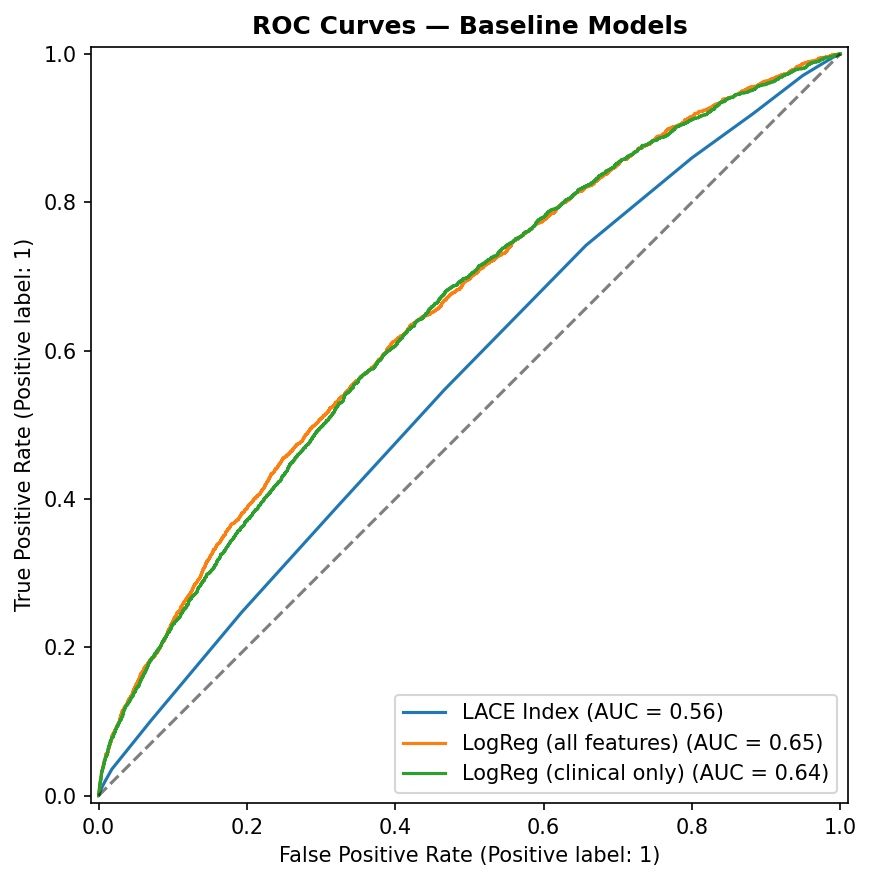
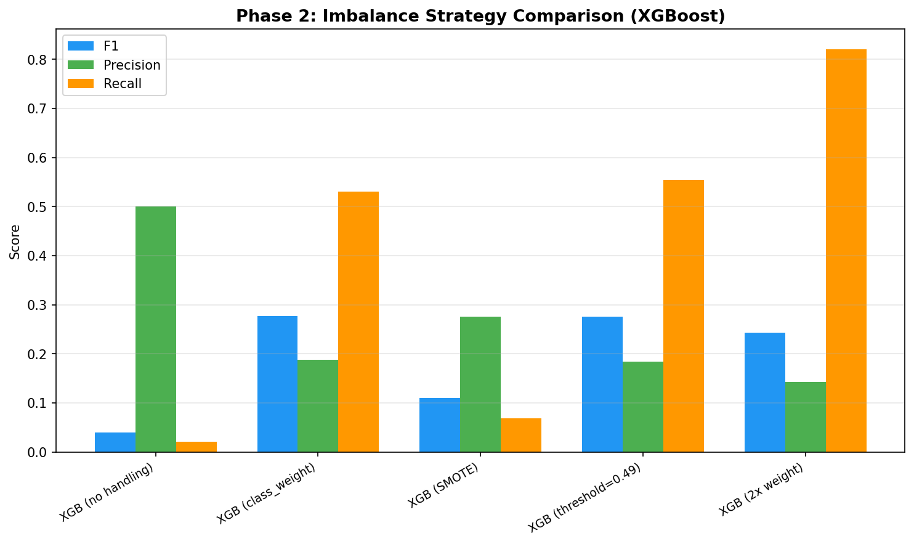
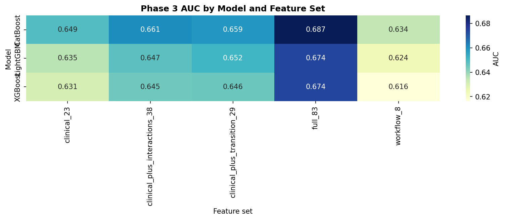

# Healthcare Readmission Predictor

Predicting 30-day hospital readmission risk for diabetic patients using ML on 101,766 real encounters from 130 US hospitals (UCI Diabetes dataset).

## Problem

Hospital readmissions cost the US healthcare system over $26 billion annually. The Hospital Readmissions Reduction Program (HRRP) penalizes hospitals with excess readmission rates. Current clinical tools like the LACE index have limited predictive power (AUC ~0.55-0.66), flagging too many patients as high-risk for meaningful intervention.

This project builds a research-grade ML pipeline that:
- Compares multiple model architectures head-to-head
- Engineers features informed by clinical literature
- Benchmarks against industry-standard clinical scoring tools
- Tests against frontier LLMs (GPT-5.4, Claude Opus 4.6) on the same prediction task

## Dataset

| Metric | Value |
|--------|-------|
| Source | UCI ML Repository — Diabetes 130-US Hospitals (1999-2008) |
| Total encounters | 101,766 |
| Readmission rate | 11.2% (30-day) |
| Features (raw) | 50 |
| Features (engineered) | 69 |
| Train/Test split | 80/20 stratified |

## Current Status

**Phase:** 3 of 7 completed
**Best Model:** CatBoost on full 83-feature matrix (AUC 0.687, F1 0.282)
**Target:** AUC > 0.70 (published SOTA: 0.78-0.87)
**Models Compared:** 26 configurations across 3 phases

## Key Findings

1. CatBoost on full 83-feature matrix is champion — AUC 0.687, F1 0.282, +0.042 over Phase 1 LogReg baseline
2. SMOTE destroys performance on this dataset — F1 drops 0.277→0.104; cost-sensitive class weighting is strictly superior
3. Tree models extract +0.037-0.043 AUC from one-hot features that LogReg misses — nonlinear interactions in admin/demographic categoricals carry real signal
4. Grouped discharge/admission transition semantics improve compact CatBoost recall 0.544→0.598, but raw `discharge_disposition_id` dominates the full-matrix model
5. LACE index flags 61% of all patients for 74% recall — clinically unusable alert volume

## Iteration Summary

<!-- Iteration summaries appended daily by readme-updater cron -->
<!-- Format: Phase N: Title — Date (one combined entry per phase) -->

### Phase 1: Domain Research + Dataset + Baseline — 2026-04-01

<table>
<tr>
<td valign="top" width="38%">

**Clinical Features:** Built LACE index proxy, then LogReg on 68 and 23 clinical features. 23-feature clinical LogReg (AUC 0.645) nearly matched all 68 features (AUC 0.648) — domain knowledge compresses feature space 66% with negligible loss.<br><br>
**Workflow Features:** Compressed to 8 workflow proxies (prior utilization, LOS, medication burden, test-ordering flags). Linear SVM hit AUC 0.633 — only 0.012 behind the 23-feature model. Missingness-only BernoulliNB collapsed to AUC 0.539.

</td>
<td align="center" width="24%">



</td>
<td valign="top" width="38%">

**Combined Insight:** Signal is highly compressible but not infinitely so. 23 features → 8 workflow features loses only 0.012 AUC, but pure missingness features carry almost no signal. The floor is utilization + LOS, not lab ordering patterns alone.<br><br>
**Surprise:** A1C ordering correlates with *lower* readmission; glucose ordering with *higher* — asymmetric, not a uniform "tested = sicker" pattern.<br><br>
**Research:** Mcllhargey et al. 2023 — missing lab patterns reflect clinician concern, so we used test-ordering as first-class features. Held for glucose, not A1C.<br><br>
**Best Model So Far:** LogReg (68 features, balanced) — AUC 0.648, F1 0.260, Recall 0.537

</td>
</tr>
</table>

---

### Phase 2: Multi-Model Experiment — 2026-04-02

<table>
<tr>
<td valign="top" width="38%">

**Model Run 1 (Full Features):** Compared 6 model families (XGBoost, LightGBM, CatBoost, RF, GBM, SVM-RBF) on 68 and 23 features, then tested 5 imbalance strategies on XGBoost. CatBoost won at AUC 0.686, F1 0.283, Recall 0.585.<br><br>
**Model Run 2 (Workflow Features):** Re-ran the top 3 boosters on the compact 8-feature workflow set to test whether better algorithms could rescue underspecified features. CatBoost on workflow-only hit AUC 0.634 — feature bottleneck remained.

</td>
<td align="center" width="24%">



</td>
<td valign="top" width="38%">

**Combined Insight:** Model family matters less than feature quality. CatBoost on 68 features gained +0.041 AUC over Phase 1; on 8 workflow features it gained only +0.001. The algorithm upgrade only pays off when features are rich enough to exploit.<br><br>
**Surprise:** SMOTE was catastrophically bad — F1 dropped 0.277→0.104. Synthetic oversampling in a 68-dimensional sparse binary space generates fractional values that don't represent real patients.<br><br>
**Research:** Rajkomar et al. 2018 (boosted trees dominate structured EHR tasks) + Kaggle community (SMOTE hurts at 8:1 categorical imbalance) — both held exactly.<br><br>
**Best Model So Far:** CatBoost (68 features, class_weight) — AUC 0.686, F1 0.283, Recall 0.585

</td>
</tr>
</table>

---

### Phase 3: Feature Engineering — 2026-04-02

<table>
<tr>
<td valign="top" width="38%">

**Feature Set 1 (Transition Flags):** Varied feature sets from workflow-only (8) to clinical + transition flags (29) to clinical + interactions (38). Grouped discharge/admission semantics gave the clearest lift: +0.010 AUC and +0.054 recall vs clinical-only.<br><br>
**Feature Set 2 (Full Matrix):** Re-ran the same boosters on the full engineered 83-feature matrix as a control. CatBoost on full 83 features remained champion at AUC 0.687 — raw admin detail still dominates.

</td>
<td align="center" width="24%">



</td>
<td valign="top" width="38%">

**Combined Insight:** Grouped transition semantics are the only compact engineering move that clearly helped (+0.010 AUC, +0.054 recall on 29 features). A larger 9-interaction bundle added noise. Raw `discharge_disposition_id` drives two-thirds of the full-matrix lift — semantic grouping captures only one-third.<br><br>
**Surprise:** The 29-feature transition set beat the full 83-feature model on recall (0.598 vs 0.576) while losing AUC — a real precision/recall tradeoff useful for high-sensitivity triage.<br><br>
**Research:** Woudneh et al. 2025 (discharge transitions drive readmission) + Hohl et al. 2021 (polypharmacy + LOS increase risk) — transitions confirmed, interactions did not add beyond simpler flags.<br><br>
**Best Model So Far:** CatBoost (full 83 features) — AUC 0.687, F1 0.282, Recall 0.576

</td>
</tr>
</table>

---

## Project Structure

```
Healthcare-Readmission-Predictor/
├── src/                  # Source code (data pipeline, training, evaluation)
├── data/                 # Datasets (raw + processed)
├── models/               # Saved model artifacts
├── results/              # Metrics, plots, experiment logs
├── reports/              # Daily detailed research reports
├── tests/                # Unit and integration tests
├── config/               # Configuration files
├── notebooks/            # EDA notebooks
└── app.py                # Streamlit/Gradio UI (Phase 6)
```

## References

1. [Effective hospital readmission prediction models using machine-learned features, BMC Health Services Research 2022](https://link.springer.com/article/10.1186/s12913-022-08748-y)
2. [ML-based prediction model for 30-day readmission risk in elderly patients, PMC 2025](https://pmc.ncbi.nlm.nih.gov/articles/PMC12819643/)
3. [Heart failure readmission — optimal feature set, Frontiers in AI 2024](https://www.frontiersin.org/journals/artificial-intelligence/articles/10.3389/frai.2024.1363226/full)
4. [UCI ML Repository — Diabetes 130-US Hospitals Dataset](https://archive.ics.uci.edu/dataset/296)
